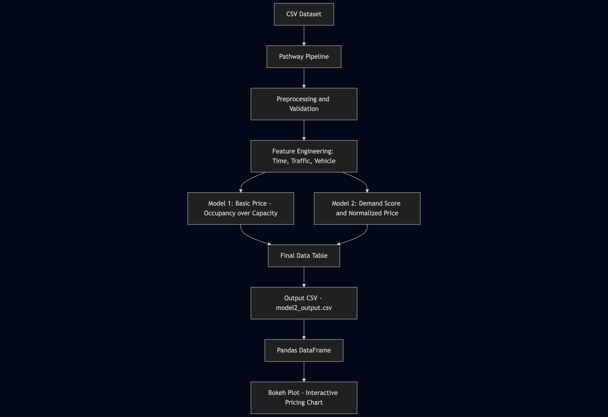

# 🚗 Urban Parking Dynamic Pricing System

This project simulates real-time dynamic pricing for urban parking lots using occupancy, traffic, and contextual data. Implemented using **Pathway** for stream simulation and processing, and **Bokeh** + **Panel** for interactive time-series visualizations.

---

## 📌 Table of Contents

- [Overview](#-overview)
- [Problem Statement](#-problem-statement)
- [Tech Stack](#-tech-stack)
- [Model Descriptions](#-model-descriptions)
- [Project Structure](#-project-structure)
- [How to Run](#-how-to-run)
- [Visualization Samples](#-visualization-samples)

---

## 🧠 Overview

With increasing urbanization, demand for smart parking systems has grown. This project presents two models for calculating dynamic prices for parking lots based on real-time data streams. It leverages time, location, vehicle type, traffic conditions, and queue length to model pricing dynamically.

---

## 🧩 Problem Statement

> Build a streaming application that:
>
> - Simulates live parking lot data.
> - Computes dynamic parking prices using **two distinct pricing models**.
> - Outputs interactive plots per parking lot to track how prices evolve over time.

---

### 🧭 Architecture Diagram




## 🛠 Tech Stack

| Component        | Tool/Library        |
|------------------|---------------------|
| Stream Processing | [Pathway](https://pathway.com) |
| Visualization    | [Bokeh](https://bokeh.org), [Panel](https://panel.holoviz.org) |
| Data Manipulation | [Pandas](https://pandas.pydata.org/) |
| Notebook Interface | Jupyter Notebook |
| Programming Language | Python 3.9+ |
| Data Source      | Custom `dataset.csv` with timestamped parking data |

---

## 🧪 Model Descriptions

### ✅ Model 1 (Simple Pricing Model)
- **Price = base_rate × occupancy rate + queue length adjustment**
- No contextual factors like traffic or time.
- Serves as a baseline pricing mechanism.

### ✅ Model 2 (Advanced Weighted Pricing Model)
- Price is computed using the following weighted formula:

Demand = α * (Occupancy / Capacity)
+ β * QueueLength
+ γ * TrafficWeight
+ δ * IsSpecialDay
+ ε * VehicleTypeWeight
+ ζ * HourFactor


- Final price: Price = BASE_PRICE * (1 + λ * NormalizedDemand)

- Bounded between 0.5× and 2× of base price.

---

## Project Workflow

### 1. Input Source
The input comes from `dataset.csv`, containing:
- Occupancy and capacity of each lot
- Queue length
- Vehicle type (car, truck, bike)
- Traffic condition (low, medium, high)
- Date and time of observation

---

### 2. Ingestion and Preprocessing (Pathway)
- Data is loaded via `pathway.io.csv.read()` in **static mode**
- Invalid rows are removed (e.g., negative occupancy)
- Timestamps are merged into `datetime_str`
- Hour of day is extracted for later modeling

---

### 3. Feature Engineering
- Assign **vehicle type weight** (e.g., truck = 1.5, bike = 0.5)
- Assign **traffic weight** (e.g., high = 1.3, low = 1.0)
- Compute **occupancy rate** = `Occupancy / Capacity`

---

### 4. Pricing Models

#### Model 1
Simple model:
```
Price = (Occupancy / Capacity) * 10
```

#### Model 2
Advanced pricing using weighted demand score:
```
Demand Score = α·(Occupancy/Capacity) + β·Queue + γ·Traffic + δ·SpecialDay + ε·VehicleWeight + ζ·HourFactor
```
- Scores are normalized and converted to price
- Price is bounded between **0.5x** and **2x** base price (base = ₹10)

---

### 5. Output Generation
- Final enriched output is written to `model2_output.csv`
- Includes: demand score, normalized demand, and computed dynamic price

---

### 6. Visualization (Bokeh + Panel)
- Output is read using **pandas**
- Time-series line plots show price variation across parking lots
- Interactive Bokeh chart rendered inside Jupyter using Panel


### Model 1 Output


### Model 2 Output


## Tech Stack

- Python 3.9
- [Pathway](https://pathway.com/)
- Pandas
- Bokeh
- Panel

---

## Run Instructions

1. Clone the repository
2. Install dependencies:
    ```
    pip install pathway bokeh panel pandas
    ```
3. Place `dataset.csv` in root directory
4. Run the notebook or script to generate output and plot

---

## References

- Pathway Documentation: https://pathway.com/docs/
- Bokeh Docs: https://docs.bokeh.org/
- Panel Docs: https://panel.holoviz.org/

---

## Author

**Parth Mishra**  
B.E. Computer Engineering  
Thapar Institute of Engineering and Technology, Patiala  

---


