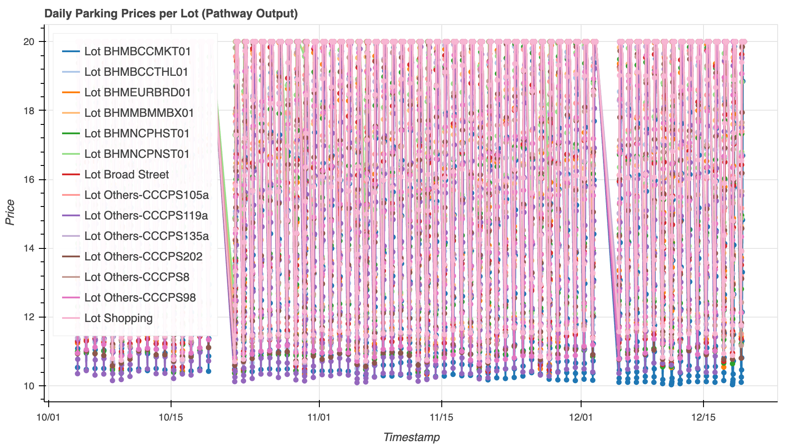
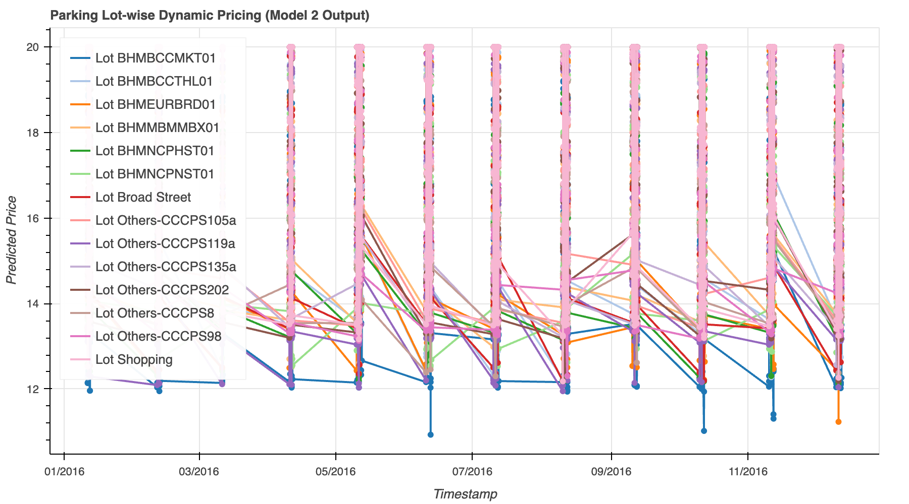

# 🚗 Urban Parking Dynamic Pricing System

This project simulates real-time dynamic pricing for urban parking lots using occupancy, traffic, and contextual data. Implemented using **Pathway** for stream simulation and processing, and **Bokeh** + **Panel** for interactive time-series visualizations.

---

## 📌 Table of Contents

- [Overview](#-overview)
- [Problem Statement](#-problem-statement)
- [Tech Stack](#-tech-stack)
- [Model Descriptions](#-model-descriptions)
- [Project Structure](#-project-structure)
- [How to Run](#-how-to-run)
- [Visualization Samples](#-visualization-samples)

---

## 🧠 Overview

With increasing urbanization, demand for smart parking systems has grown. This project presents two models for calculating dynamic prices for parking lots based on real-time data streams. It leverages time, location, vehicle type, traffic conditions, and queue length to model pricing dynamically.

---

## 🧩 Problem Statement

> Build a streaming application that:
>
> - Simulates live parking lot data.
> - Computes dynamic parking prices using **two distinct pricing models**.
> - Outputs interactive plots per parking lot to track how prices evolve over time.

---

## 🛠 Tech Stack

| Component        | Tool/Library        |
|------------------|---------------------|
| Stream Processing | [Pathway](https://pathway.com) |
| Visualization    | [Bokeh](https://bokeh.org), [Panel](https://panel.holoviz.org) |
| Data Manipulation | [Pandas](https://pandas.pydata.org/) |
| Notebook Interface | Jupyter Notebook |
| Programming Language | Python 3.9+ |
| Data Source      | Custom `dataset.csv` with timestamped parking data |

---

## 🧪 Model Descriptions

### ✅ Model 1 (Simple Pricing Model)
- **Price = base_rate × occupancy rate + queue length adjustment**
- No contextual factors like traffic or time.
- Serves as a baseline pricing mechanism.

### ✅ Model 2 (Advanced Weighted Pricing Model)
- Price is computed using the following weighted formula:

Demand = α * (Occupancy / Capacity)
+ β * QueueLength
+ γ * TrafficWeight
+ δ * IsSpecialDay
+ ε * VehicleTypeWeight
+ ζ * HourFactor


- Final price: Price = BASE_PRICE * (1 + λ * NormalizedDemand)

- Bounded between 0.5× and 2× of base price.

---

## 📂 Project Structure

capstone-parking-dynamic-pricing/
│
── dataset.csv # Source dataset
── final_capstone_project.ipynb # Jupyter Notebook with Model 2 logic
── model2_output.csv # Final Pathway output with dynamic pricing
── bokeh_plot.png # Model 1 visualization output
── bokeh_plot_2.png # Model 2 visualization output
-─ README.md # Project documentation


---

## 🚀 How to Run

1. **Clone the repository**:
   ```bash
   git clone https://github.com/perrysolid/Capstone_IITG.git
   cd Capstone_IITG


Run all cells to:

Load dataset.csv

Simulate streaming

Compute prices with Pathway

Visualize using Bokeh and Panel

## 📈 Dynamic Pricing Visualizations

### Model 1 Output


### Model 2 Output



